# Proyecto_Programacion

##Herramientas utilizadas:

1. PHPStorm
2. XAMMP
3. Boostrap
4. Javascrip
5. Font Awesome

##Zona Administrador

Por parte del administrador pues empezamos agregando producto
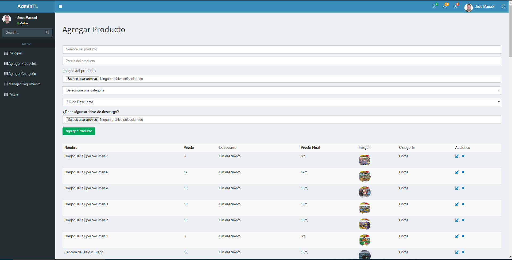

Una vez agregado puede modificar los productos 
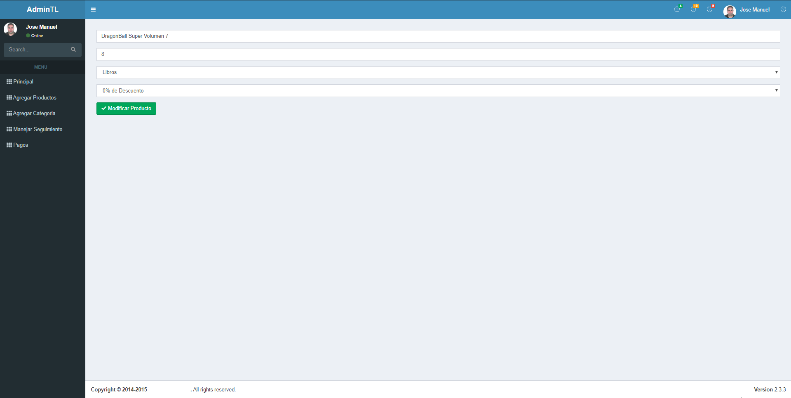

Tambien puede ver el seguimiento de los pedidos
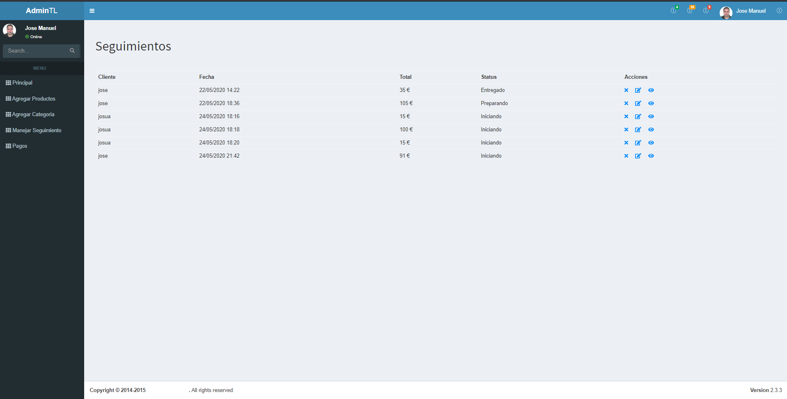

Podemos visualizar el apartado de los pagos para ver si el cliente a pagado y poder verificar dicho pago
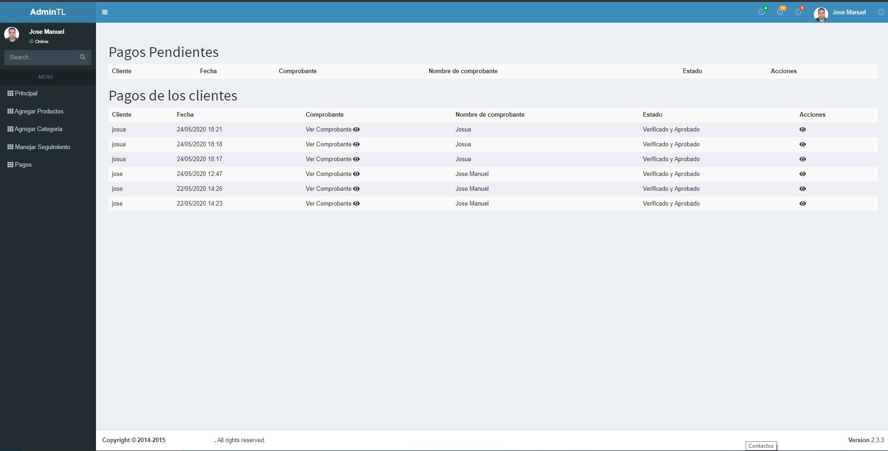

##Zona Cliente

Lo primero que vera el cliente es la pagina principal ya este registrado o no
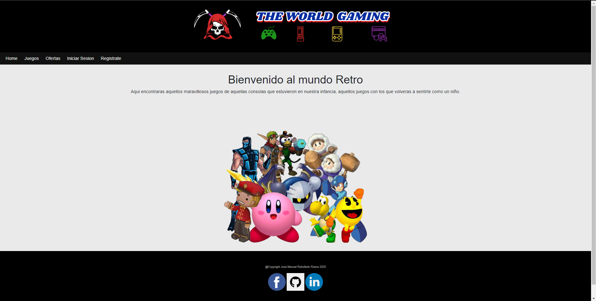

Lo siguiente que debe hacer el cliente es registrarse o iniciar sesion en el caso de que ya estuviera registrado
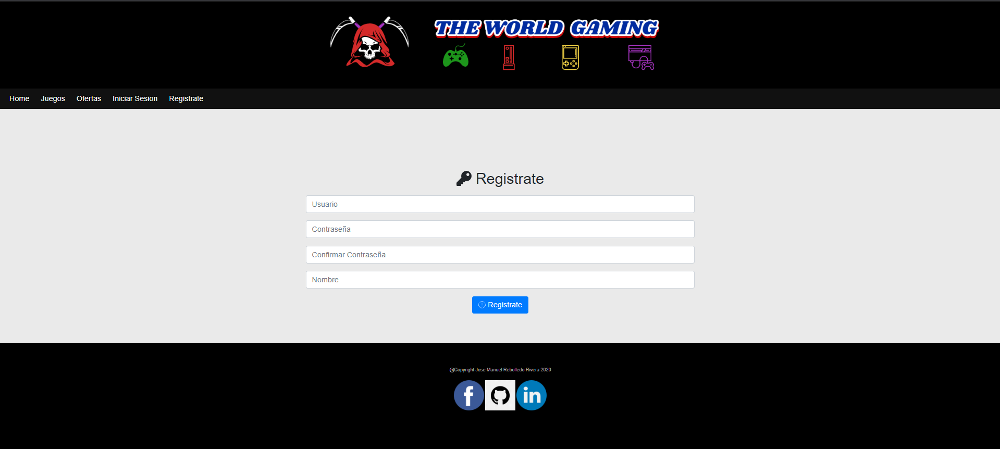
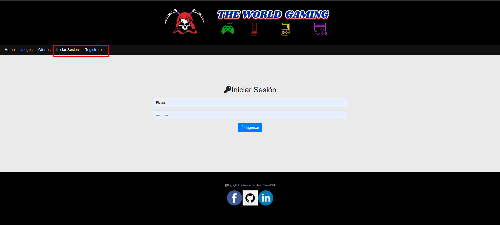

Una vez dentro el cliente puede dirigirse al apartado de juegos donde vera todos los producto que hay en la tiena y podra buscarlo por categoria
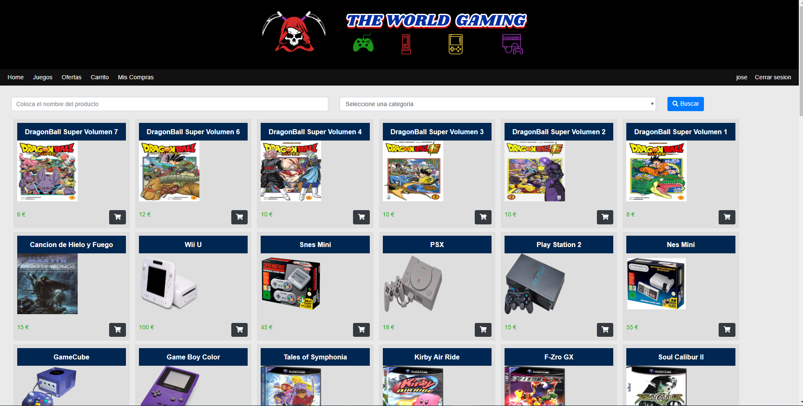

Tambien puede visualizar los productos que estan en oferta desde el menu oferta
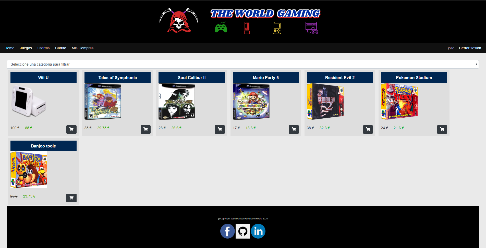

Una vez haya elegido producto para comprar se podra dirigir al carro para finalizar la compra
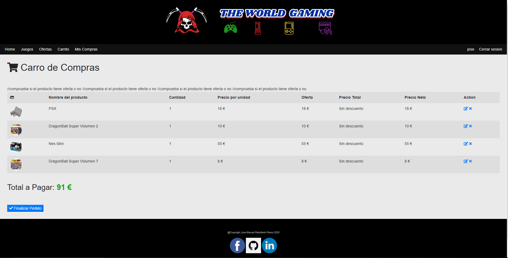

Una vez finalizada la compra se le mandara al apartado de pago donde colocara el comprobante de la transferencia realizada por paypal
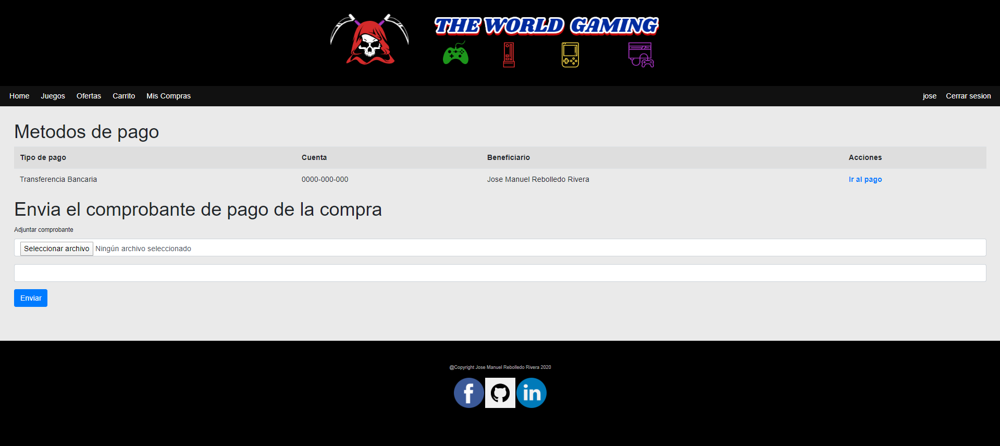

Una vez finalizado el pago el cliente puede ver sus compras desde el apartado mis compra donde podra ver sus compras y podra visualizar alguna de ellas

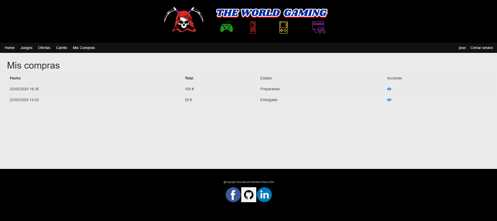

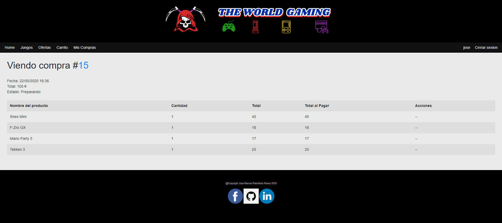

